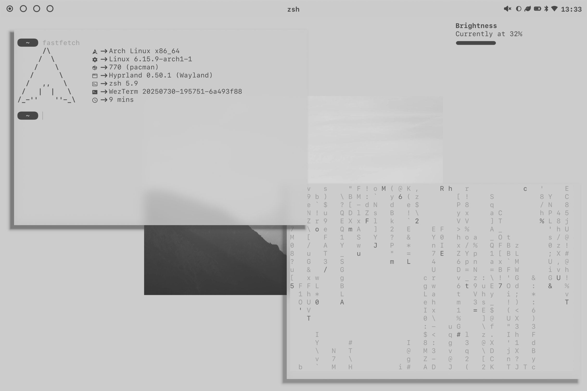
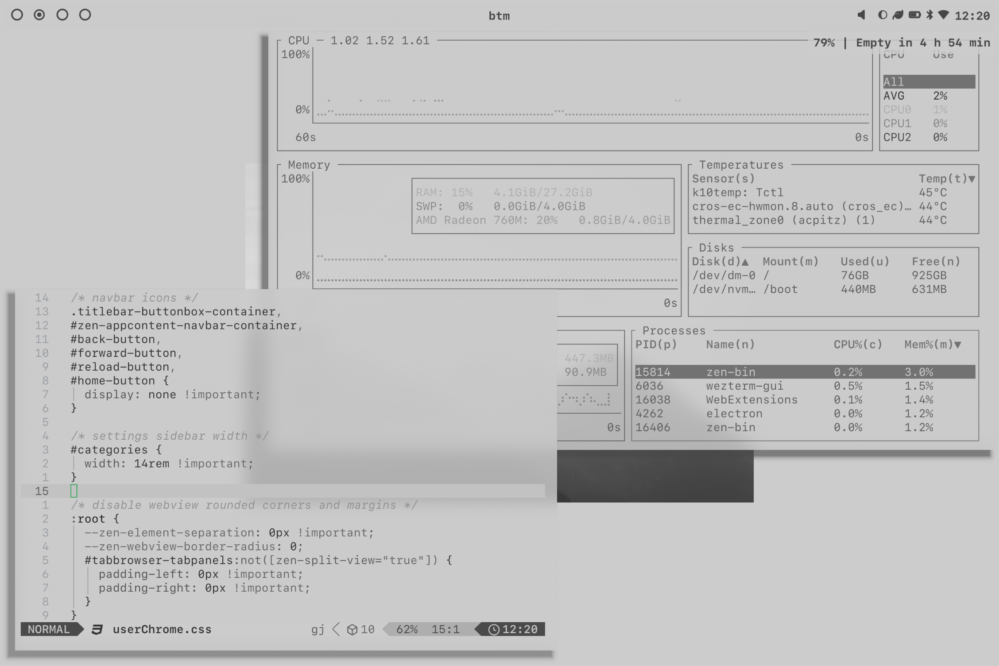
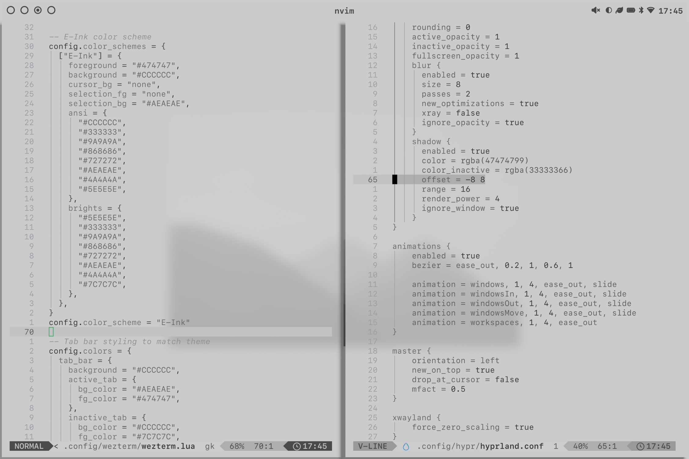

<h1 align="center">z0xca/dotfiles</h1>

## Gallery

- P.1: [fastfetch](https://github.com/fastfetch-cli/fastfetch), [cmatrix](https://github.com/abishekvashok/cmatrix), [dunst](https://github.com/dunst-project/dunst)
- P.2: [neovim](https://github.com/neovim/neovim) with [LazyVim](https://github.com/LazyVim/LazyVim), [bottom](https://github.com/ClementTsang/bottom)
- P.3: [yazi](https://github.com/sxyazi/yazi), [zen](https://github.com/zen-browser/desktop)
- P.4: [tofi](https://github.com/philj56/tofi)

# Software

- Distro: [Arch Linux](https://archlinux.org)
- WM: [Hyprland](https://github.com/hyprwm/Hyprland)
- Panel: [Waybar](https://github.com/Alexays/Waybar)
- Launcher: [tofi](https://github.com/philj56/tofi)
- Terminal: [wezterm](https://github.com/wezterm/wezterm)
- Shell: [zsh](https://github.com/zsh-users/zsh)
- File Manager: [yazi](https://github.com/sxyazi/yazi)
- Notifications: [dunst](https://github.com/dunst-project/dunst)
- Image Viewer: [imv](https://sr.ht/~exec64/imv/)
- Video Player: [clapper](https://github.com/Rafostar/clapper)
- Lockscreen: [hyprlock](https://github.com/hyprwm/hyprlock)
- Idle daemon: [hypridle](https://github.com/hyprwm/hypridle)

- System Monitor: [Bottom](https://github.com/ClementTsang/bottom)
- Wi-Fi manager: [iwmenu](https://github.com/e-tho/iwmenu)
- Bluetooth manager: [bzmenu](https://github.com/e-tho/bzmenu)
- Volume Control: [pavucontrol](https://github.com/pulseaudio/pavucontrol)
- Browser: [Zen](https://github.com/zen-browser/desktop)

- Fonts: [San Francisco](https://gitlab.com/chaotic-aur/pkgbuilds/-/tree/main/apple-fonts) and [Monaspace Neon](https://github.com/githubnext/monaspace)
- Cursor: [Posy's Cursor Mono Black](https://github.com/simtrami/posy-improved-cursor-linux)
- GTK theme: [Orchis Light](https://github.com/vinceliuice/Orchis-theme)
- Global theme palette: [e-ink-colorscheme](https://github.com/e-ink-colorscheme)

# Inspiration

https://www.reddit.com/r/unixporn/comments/1ivfd53/rectangle_i_really_really_like_eink
